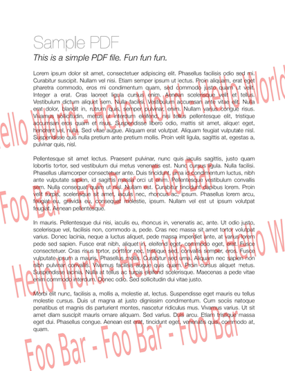
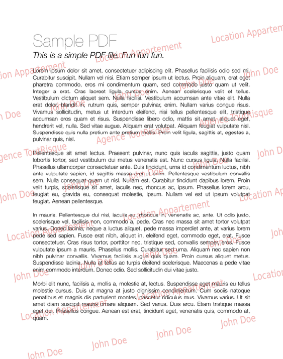

# watermark-rs

A rust cli to add watermarks to pdf document

## Prerequisites

Install [libpdfium](https://github.com/bblanchon/pdfium-binaries) at the same level as the generated binary

## CLI Description

```bash
Usage: watermark-rs [OPTIONS] --text1 <TEXT1> <FILE>

Arguments:
  <FILE>  Path to the document to add watermarks to

Options:
      --text1 <TEXT1>                primary watermark to add
      --text2 <TEXT2>                optional secondary watermark to add - if omitted, primary watermark is used
      --text3 <TEXT3>                optional third watermark to add - if omitted, primary watermark is used
  -r, --resolution <RESOLUTION>      for smaller size, choose 'normal' (Default) - for good resolution, choose 'high' [default: normal] [possible values: normal, high]
  -t, --transparency <TRANSPARENCY>  [default: 30]
  -h, --help                         Print help
```

## Examples

# With 1 text

```bash
cargo r -- sample.pdf --text1 "Location Appartement"  -t 80 --resolution normal
```
 


# With 2 texts
```bash
cargo r -- sample.pdf --text1 "Location Appartement" --text2 "John Doe"  -t 80 --resolution normal
```
 

# With 3 texts
```bash
cargo r -- sample.pdf --text1 "Location Appartement" --text2 "John Doe" --text3 "Agence ToutRisque"  -t 80 --resolution normal
```
 
